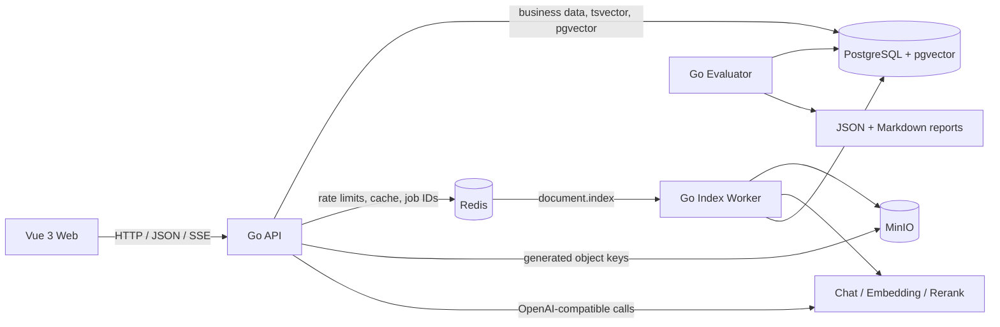
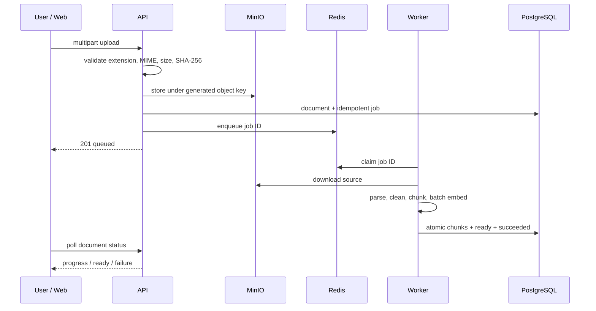
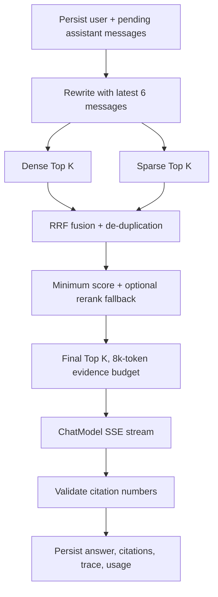

# KnowFlow architecture

KnowFlow is a modular monolith with two independent Go processes. The API owns synchronous business operations and RAG orchestration; the Worker owns asynchronous ingestion. Both share versioned domain and platform packages without pretending to be separate microservices.

## Ingestion lifecycle

## Grounded answer path

## Trust boundaries

- Every resource query is scoped by the authenticated owner and knowledge-base ID.
- Source filenames never become object-store paths; object keys are generated server-side.
- API keys exist only in process environment and are represented by a redacting configuration type.
- Provider and database details are logged server-side but never returned in client error envelopes.
- Compose publishes development ports only on `127.0.0.1`.
